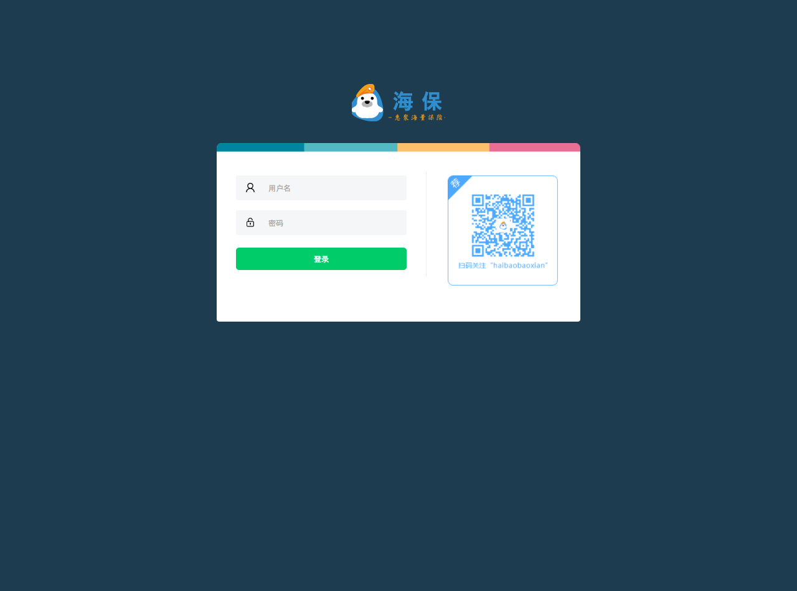

# SSO单点登录系统


- 目录结构介绍
  - backend(前台界面目录)
  - frontend(后端PHP目录)
  
  
- 配置并使用
  - 系统token存储于redis,请确保redis server开启并处于可用状态
  - 数据库存储使用mysql server,请导入backend/database/sql/insideaccount_user.sql
  - 配置.env 文件,修改DOMAIN=hb.com为你自己的域名
  - 增加nginx配置,如下所示:
  
  ```
  server {
      listen 80;
      server_name insideaccount.hb.com;
      root /Users/laolu/www/haibao-php-insideaccount/frontend/;
      index index.html;
      location ~ .*/.(css|js)$ {
       add_header Cache-Control 'no-store';
      }
  
      location /backend/ {
          proxy_pass http://127.0.0.1:9191/;
          proxy_set_header X-real-IP $remote_addr;
          proxy_set_header Host $host;
          proxy_redirect off;
      }
  }
  
  server {
      listen 9191;
      root /Users/laolu/www/haibao-php-insideaccount/backend/public;
      index index.php;
      try_files $uri $uri/ /index.php?query_string;
      location ~ \.php {
          fastcgi_pass 127.0.0.1:9000;
          fastcgi_index index.php;
          fastcgi_param SCRIPT_FILENAME $document_root$fastcgi_script_name;
          include fastcgi_params;
      }
  }
  
  
  ```
  
  - 预览
  